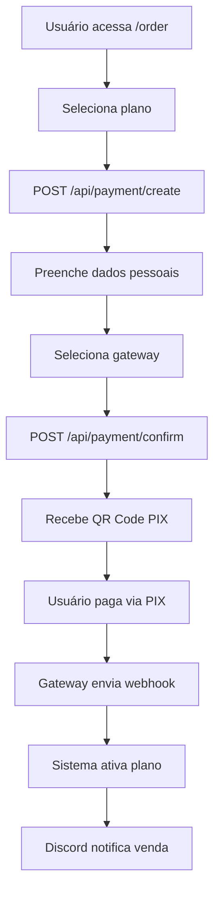
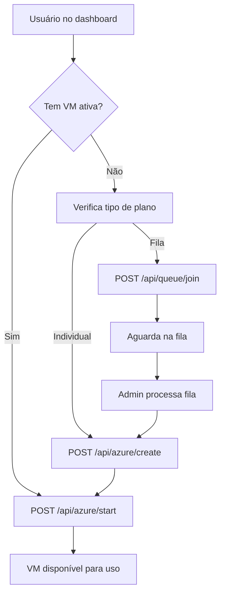

# 🌩️ DarkCloud

<div align="center">
  
  <p><strong>Plataforma moderna de gerenciamento de VMs na Azure com sistema de filas inteligente</strong></p>
  
  
  
  
  
</div>

## 📋 Sobre o Projeto

**DarkCloud** é uma plataforma completa de gerenciamento de máquinas virtuais Azure com foco em gaming e aplicações GPU-intensivas. O sistema oferece múltiplos tipos de provisionamento, autenticação Discord, processamento de pagamentos PIX e painel administrativo avançado.

## 🏗️ Arquitetura do Sistema

### 📊 **Banco de Dados (Supabase/PostgreSQL)**
```sql
-- Estrutura principal das tabelas
profiles          -- Usuários com níveis de permissão (user/admin/owner)
plans            -- Planos de assinatura com tipos de provisionamento
user_plans       -- Assinaturas ativas dos usuários
machines         -- VMs Azure com status e configurações
queue            -- Sistema de fila básica (FIFO)
auto_queue       -- Sistema de fila automática com sessões
time_slots       -- Slots de tempo para fila automática
payments         -- Transações e histórico de pagamentos
stock_pools      -- Pools de estoque compartilhado
coupons          -- Sistema de cupons de desconto
coupon_usages    -- Controle de uso de cupons
```

### 🔀 **Tipos de Provisionamento**
1. **Individual**: VM dedicada com estoque próprio
2. **Fila Manual**: Admin aloca VMs manualmente do pool
3. **Fila Automática**: Time-slots com duração e renovação automática

## 🛣️ Documentação das Rotas API

### 🔐 **Autenticação** (`/api/auth/`)
```typescript
GET  /api/auth/callback     // Callback OAuth Discord
GET  /api/auth/check        // Verificar status de autenticação
```

### 👤 **Usuários** (`/api/user/`)
```typescript
GET  /api/user/plans                 // Listar planos ativos do usuário
GET  /api/user/plans/active          // Planos ativos (admin only)
GET  /api/user/plans/cancelled       // Planos cancelados (admin only)
GET  /api/user/plans/expired         // Planos expirados (admin only)
```

### 🎯 **Planos** (`/api/plans/`)
```typescript
GET  /api/plans                      // Listar planos ativos com estoque
GET  /api/plans/cancelled            // Planos cancelados
GET  /api/plans/check                // Verificar status do plano
GET  /api/plans/deactivate           // Desativar plano
GET  /api/plans/expired              // Planos expirados
GET  /api/plans/reactivate           // Reativar plano
POST /api/plans/renew                // Renovar plano existente
```

**Fluxo de Renovação de Planos:**
1. Cliente acessa `/order/renewal`
2. Sistema busca planos ativos via `/api/plans/check`
3. Apresenta opções de renovação
4. Processa pagamento via `/api/plans/renew`

### 💰 **Pagamentos** (`/api/payment/`)
```typescript
POST /api/payment/create             // Criar nova transação
POST /api/payment/confirm            // Confirmar pagamento e gerar PIX
GET  /api/payment/status             // Verificar status do pagamento
PUT  /api/payment/update             // Atualizar status (interno)
```

**Fluxo de Pagamento:**
1. **Criação**: `POST /api/payment/create` → Gera ID de transação
2. **Confirmação**: `POST /api/payment/confirm` → Gera QR Code PIX
3. **Webhook**: `/api/webhook/efi` ou `/api/webhook/openpix` → Confirma pagamento
4. **Ativação**: Sistema ativa plano automaticamente

### 🎮 **Máquinas Virtuais** (`/api/machine/` e `/api/azure/`)

#### Gerenciamento Geral:
```typescript
GET  /api/machine/get                // Obter VM específica
GET  /api/machine/getAll             // Listar todas as VMs (admin)
GET  /api/machine/getAllUser         // Listar VMs do usuário
PUT  /api/machine/update             // Atualizar configurações da VM
DELETE /api/machine/delete           // Deletar VM
```

#### Operações Azure:
```typescript
POST /api/azure/create               // Criar nova VM na Azure
GET  /api/azure/get                  // Status da VM na Azure
GET  /api/azure/getAll               // Listar VMs Azure (admin)
POST /api/azure/start                // Iniciar VM
POST /api/azure/stop                 // Parar VM
DELETE /api/azure/delete             // Deletar VM da Azure
GET  /api/azure/snapshot/getAll      // Listar snapshots disponíveis
```

**Fluxo de Criação de VM:**
1. **Validação**: Sistema verifica plano ativo e estoque
2. **Criação Azure**: `POST /api/azure/create` → Cria VM com snapshot
3. **Registro**: VM registrada no banco via `/api/machine/update`
4. **Inicialização**: `POST /api/azure/start` → VM fica disponível

### 🏃 **Sistema de Filas** (`/api/queue/`)

#### Fila Básica:
```typescript
POST /api/queue/join                 // Entrar na fila
DELETE /api/queue/leave              // Sair da fila
GET  /api/queue/position             // Verificar posição
GET  /api/queue/stats                // Estatísticas da fila
GET  /api/queue/machines             // VMs disponíveis para fila
```

#### Administração da Fila:
```typescript
POST /api/queue/admin/activate       // Ativar fila
POST /api/queue/admin/deactivate     // Desativar fila
POST /api/queue/admin/next           // Processar próximo da fila
POST /api/queue/admin/clear          // Limpar fila
GET  /api/queue/admin/stats          // Estatísticas administrativas
```

**Fluxo da Fila Básica:**
1. **Entrada**: `POST /api/queue/join` → Usuário entra na fila
2. **Posicionamento**: Sistema calcula posição via FIFO
3. **Processamento**: Admin usa `/api/queue/admin/next` → Aloca VM
4. **Notificação**: Discord webhook notifica usuário

### 💾 **Gerenciamento de Discos** (`/api/disks/`)
```typescript
GET  /api/disks/my-disks             // Discos do usuário
GET  /api/disks/sessions             // Sessões ativas de disco
```

### 🎫 **Sistema de Cupons** (`/api/coupon/`)
```typescript
POST /api/coupon/create              // Criar novo cupom (admin)
GET  /api/coupon/getAll              // Listar cupons (admin)
POST /api/coupon/validate            // Validar cupom
POST /api/coupon/use                 // Usar cupom
```

### 🔗 **Webhooks** (`/api/webhook/`)
```typescript
POST /api/webhook/efi                // Webhook EFI/GerenciaNet
POST /api/webhook/openpix            // Webhook OpenPix
POST /api/webhook/log                // Log de webhooks
```

**Fluxo de Webhooks:**
1. **Recebimento**: Gateway envia POST para webhook
2. **Validação**: Sistema verifica assinatura
3. **Processamento**: Atualiza status do pagamento
4. **Ativação**: Se aprovado, ativa plano automaticamente
5. **Notificação**: Discord webhook informa sobre venda

### 🛠️ **Administração** (`/api/admin/`)

#### Gerenciamento de Usuários:
```typescript
GET  /api/admin/users                // Listar usuários
GET  /api/admin/users/[id]/history   // Histórico do usuário
GET  /api/admin/users/[id]/personal-data // Dados pessoais
POST /api/admin/users/assign-plan    // Atribuir plano manualmente
PUT  /api/admin/set-level            // Alterar nível de permissão
```

#### Gerenciamento de Planos:
```typescript
GET  /api/admin/plans                // Listar todos os planos
POST /api/admin/plans                // Criar novo plano
PUT  /api/admin/plans                // Atualizar plano
DELETE /api/admin/plans              // Deletar plano (soft delete)
```

#### Outros:
```typescript
GET  /api/admin/getAll               // Dashboard data
GET  /api/admin/vm-management        // Gerenciamento de VMs
POST /api/admin/vm/register          // Registrar VM manualmente
GET  /api/admin/gateways             // Configurações de pagamento
PUT  /api/admin/gateways/update      // Atualizar gateways
GET  /api/admin/stock-pools          // Pools de estoque
GET  /api/admin/coupons              // Gerenciar cupons
```

## 🔄 Fluxos Principais

### 📝 **Fluxo de Compra Completo**


### 🎮 **Fluxo de Uso da VM**


### 👨‍💼 **Fluxo Administrativo**
```mermaid
graph TD
    A[Admin acessa /admin] --> B[Dashboard Overview]
    B --> C{Ação desejada}
    C -->|Gerenciar usuários| D[/admin/users]
    C -->|Gerenciar planos| E[/admin/plans]
    C -->|Processar fila| F[/admin/queue]
    C -->|Monitorar VMs| G[/admin/machines]
    E --> H[CRUD de planos com validação]
    F --> I[Alocação manual de VMs]
    G --> J[Controle remoto de VMs]
```

## ⚙️ Stack Tecnológica

### 🎨 **Frontend**
- **Framework**: Next.js 15 (App Router)
- **Linguagem**: TypeScript
- **UI**: Radix UI + TailwindCSS + shadcn/ui
- **Gerenciamento de Estado**: Zustand
- **Notificações**: Sonner (Toast)

### 🔧 **Backend**
- **Runtime**: Next.js API Routes
- **Database**: Supabase (PostgreSQL)
- **Autenticação**: Supabase Auth + Discord OAuth
- **ORM**: Direct Supabase Client

### ☁️ **Cloud & Infraestrutura**
- **Cloud Provider**: Microsoft Azure
- **VMs**: Azure Compute + Network
- **Storage**: Azure Snapshots + Disks
- **CDN**: Next.js Image Optimization

### 💳 **Pagamentos**
- **EFI (GerenciaNet)**: PIX com certificado .p12
- **OpenPix**: PIX com App ID
- **Webhooks**: Processamento em tempo real

## 🚀 Instalação e Configuração

### 📋 **Pré-requisitos**
- Node.js 18+
- npm/yarn/pnpm
- Conta Supabase
- Aplicativo Discord
- Conta Azure com permissões
- Gateway de pagamento (EFI/OpenPix)

### 🔧 **Instalação**

1. **Clone o repositório**
```bash
git clone https://github.com/nyxbyt3/dark.git
cd dark
```

2. **Instale dependências**
```bash
npm install
```

3. **Configure variáveis de ambiente** (veja `env.example`)
```env
# Supabase
SUPABASE_URL="sua_supabase_url"
SUPABASE_ANON_KEY="sua_anon_key"
SUPABASE_SERVICE_ROLE_KEY="sua_service_role_key"

# Discord
DISCORD_CLIENT_ID="sua_client_id"
DISCORD_CLIENT_SECRET="sua_client_secret"
DISCORD_WEBHOOK_VENDAS_URL="webhook_vendas"
DISCORD_WEBHOOK_LOGS_URL="webhook_logs"
DISCORD_WEBHOOK_SECURITY_URL="webhook_security"

# Azure
AZURE_SUBSCRIPTION_ID="sua_subscription"
AZURE_TENANT_ID="seu_tenant"
AZURE_CLIENT_ID="seu_client_id"
AZURE_CLIENT_SECRET="seu_client_secret"
AZURE_RESOURCE_GROUP_NAME="seu_resource_group"

# EFI (GerenciaNet)
EFI_CLIENT_ID="seu_client_id"
EFI_CLIENT_SECRET="seu_client_secret"
EFI_CERT_PATH="./certificado.p12"
EFI_SANDBOX="false"

# OpenPix
OPENPIX_APP_ID="seu_app_id"

# Database
DATABASE_URL="sua_database_url_supabase"
```

4. **Configure o banco de dados**
```bash
# Execute as migrations no Supabase Dashboard
# Ou use os arquivos em supabase/migrations/
```

5. **Inicie o desenvolvimento**
```bash
npm run dev
```

## 📁 Estrutura do Projeto

```
src/
├── app/                    # Next.js 15 App Router
│   ├── admin/             # Painel administrativo
│   │   ├── page.tsx       # Dashboard principal
│   │   └── ai-config/     # Configuração IA
│   ├── api/               # API Routes
│   │   ├── admin/         # APIs restritas (owner/admin)
│   │   ├── azure/         # Integração Azure
│   │   ├── payment/       # Sistema de pagamentos
│   │   ├── queue/         # Sistema de filas
│   │   ├── user/          # APIs do usuário
│   │   └── webhook/       # Webhooks de pagamento
│   ├── dashboard/         # Dashboard do usuário
│   ├── order/             # Fluxo de compra
│   │   ├── page.tsx       # Seleção de planos
│   │   ├── payment/       # Confirmação de pagamento
│   │   └── renewal/       # Renovação de planos
│   └── queue/             # Interface da fila
├── components/            # Componentes React
│   ├── admin/             # Componentes administrativos
│   │   ├── PlansTab/      # Gerenciamento de planos
│   │   ├── UsersTab/      # Gerenciamento de usuários
│   │   ├── MachinesTab/   # Controle de VMs
│   │   └── QueueTab/      # Controle de filas
│   ├── ui/                # shadcn/ui components
│   ├── plans/             # Componentes de planos
│   └── header/            # Navegação e autenticação
├── functions/database/    # Controllers Supabase
│   └── controllers/       # Lógica de negócio
│       ├── PlansController.tsx     # CRUD de planos
│       ├── PaymentController.tsx   # Processamento pagamentos
│       ├── QueueController.tsx     # Sistema de filas
│       └── UsersController.ts      # Gerenciamento usuários
├── lib/                   # Configurações e utilities
│   ├── azure.ts          # Cliente Azure
│   ├── discord.ts        # Webhooks Discord
│   └── supabase.ts       # Cliente Supabase
├── services/              # Serviços externos
│   ├── EfiPaymentService.ts    # Integração EFI
│   └── OpenPixPaymentService.ts # Integração OpenPix
└── utils/                 # Helpers e validadores
    ├── supabase/         # Clientes Supabase
    └── validators.ts     # Validações
```

## 🔐 Segurança e Permissões

### 🛡️ **Níveis de Acesso**
- **User**: Acesso básico (dashboard, compras)
- **Admin**: Gerenciamento limitado (usuários, filas)
- **Owner**: Acesso completo (planos, configurações)

### 🔒 **Segurança Implementada**
- ✅ **Row Level Security**: Supabase RLS ativo
- ✅ **Validação de permissões**: Todas as rotas admin verificam nível
- ✅ **Webhooks seguros**: Validação de assinaturas
- ✅ **Logs de segurança**: Tentativas não autorizadas
- ✅ **Sanitização**: Inputs validados com Zod

## 🛠️ Comandos de Desenvolvimento

```bash
# Desenvolvimento
npm run dev              # Servidor desenvolvimento (porta 3000)
npm run build           # Build otimizado para produção
npm run start           # Servidor produção
npm run lint            # ESLint + verificação de tipos

# Deploy
npm run deploy          # Build + start em produção
```

## 🧪 Testing e Debug

### 🔍 **Rotas de Teste**
```typescript
GET  /api/test/azure-health      // Verificar conexão Azure
GET  /api/status                 // Status geral do sistema
```

### 📊 **Monitoramento**
- Logs centralizados via console
- Discord webhooks para eventos importantes
- Status de saúde das integrações

## 🤝 Contribuição

### 📋 **Guidelines**
1. Fork o projeto
2. Crie branch para feature (`git checkout -b feature/NovaFeature`)
3. Commit suas mudanças (`git commit -m 'Add: NovaFeature'`)
4. Push para branch (`git push origin feature/NovaFeature`)
5. Abra Pull Request

### 🏗️ **Padrões de Código**
- **TypeScript**: Tipagem obrigatória
- **ESLint**: Linting automático
- **Naming**: camelCase para funções, PascalCase para componentes
- **Estrutura**: Mantenha a organização de pastas

## 📝 Changelog

### v2.0.0 (2024)
- ✨ **Sistema de planos moderno**: Interface completamente redesenhada
- ✨ **Fila automática**: Time-slots com gerenciamento inteligente
- ✨ **Multiple gateways**: Suporte EFI e OpenPix
- ✨ **Disk management**: Sistema de discos persistentes
- 🐛 **Correções críticas**: Cookies, validações e performance
- 🧹 **Limpeza profunda**: 30% menos arquivos, mais performance

## 📜 Licença

Este projeto está sob a licença **MIT**. Veja [LICENSE](LICENSE) para mais detalhes.

## 📞 Suporte

- 🐛 **Issues**: Reporte bugs no GitHub
- 💬 **Discussões**: Use GitHub Discussions
- 📧 **Email**: Para questões sensíveis

---

<div align="center">
  <p>Feito com ❤️ pela equipe DarkCloud</p>
  <p>
    <a href="#top">⬆️ Voltar ao topo</a>
  </p>
</div>